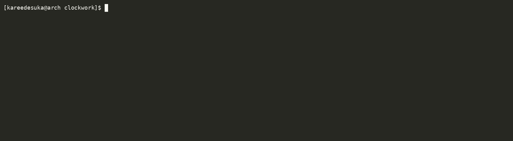
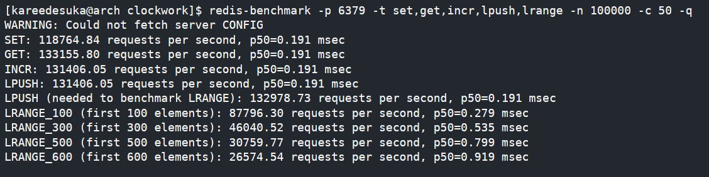
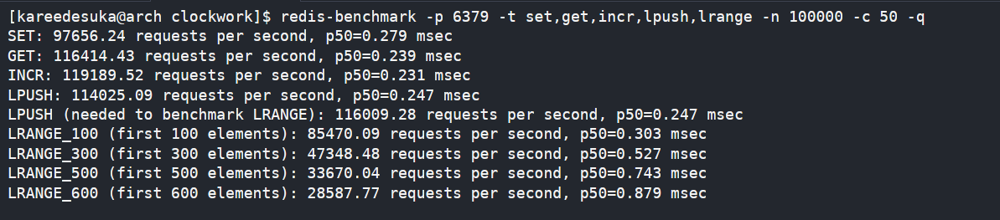

# clockwork

this is clockwork: a Redis-compatible TCP key-value store written from scratch in Go.

it speaks RESP (Redis Serialization Protocol), so `redis-cli` and `redis-benchmark` work against it without modification. no Redis installed, no external dependencies, just the Go standard library.


## Demo 


---
## what it supports

- `GET`, `SET` with TTL flags (`EX`, `PX`, `EXAT`, `PXAT`)
- `DEL`, `EXISTS`
- `INCR`, `DECR`
- `LPUSH`, `RPUSH`, `LRANGE`
- `SAVE` — atomic persistence to disk via write-then-rename
- loads persisted state from `dump.json` on startup
- concurrent clients via goroutines, safe map access via `sync.RWMutex`

---

## run it

### from source
```bash
git clone https://github.com/aryansaves/clockwork
cd clockwork
go run main.go
```

### from docker
```bash
docker run -d -p 6379:6379 aryansaves/clockwork:v1.0
```

### from release
download the latest binary for your platform from [releases](https://github.com/aryansaves/clockwork/releases/latest).


connect with `redis-cli`:

```bash
redis-cli -p 6379
```

---

## benchmark

100k requests, 50 concurrent clients against Clockwork and real Redis on the same machine.

**Clockwork**



**Redis**



Clockwork outperforms real Redis on raw GET/SET/INCR/LPUSH throughput. Real Redis carries overhead from its full feature surface — Clockwork doesn't. LRANGE degrades linearly with range size as expected.

---

## internals worth knowing

**RESP parser** — reads length-prefixed bulk strings off the TCP stream using `bufio.Reader`. skips `$` lines (length headers), collects argument values directly.

**typed store** — values are stored as `*RedisObject{Type, Value, TTL}`. the `interface{}` value holds either `string` or `[]string` depending on type. type mismatch returns `WRONGTYPE` error matching real Redis behavior.

**lazy expiry** — TTL is checked at read time, not by a background goroutine. expired keys are deleted on access. same approach real Redis uses for O(1) expiry without a sweeper.

**list storage** — lists are stored in reverse internal order so `LPUSH` is `append()` — O(1) amortized. `LRANGE` compensates with index inversion.

**persistence** — `SAVE` serializes the store to JSON, writes to a temp file, renames atomically. on startup, expired keys are discarded before loading.

---

built against the [codingchallenges.fyi Redis spec](https://codingchallenges.fyi/challenges/challenge-redis/).